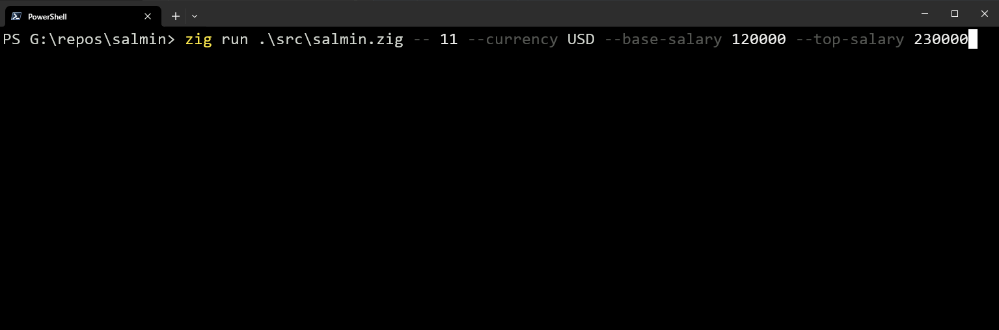

# Sal\[ary] Min\[utes]

Track the real time cost of a meeting based on the salary paid to the participants!



## Usage

Track the approximate cost of a five-participant meeting.

```sh
> salmin start 5 --currency USD --base-salary 60000 --top-salary 100000
> # Using defaults:
> salmin start 5
```

Configure default values:

```sh
> salmin config set currency USD
> salmin config set base-salary 60000
> salmin config set top-salary 100000
```

View defaults:

```sh
> salmin config show
```

